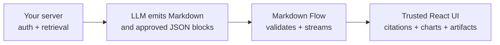

# Markdown Flow — Markdown and AI response UI for React

<p align="center">
  <a href="https://github.com/hrisheesh/markdown-flow">
    
  </a>
</p>

<p align="center">
  <strong>Turn Markdown and streamed AI output into a polished, controlled React experience.</strong><br />
  Markdown, citations, charts, diagrams, and trusted product components—without asking a model to generate your UI.
</p>

<p align="center">
  <a href="https://www.npmjs.com/package/markdown-flow"></a>
  <a href="https://www.npmjs.com/package/markdown-flow"></a>
  <a href="https://github.com/hrisheesh/markdown-flow/actions"></a>
  <a href="https://github.com/hrisheesh/markdown-flow/blob/main/LICENSE"></a>
  <a href="https://github.com/hrisheesh/markdown-flow"></a>
</p>

<p align="center">
  <a href="#quick-start">Quick start</a> ·
  <a href="#why-markdown-flow">Why Markdown Flow</a> ·
  <a href="#ai-responses-in-three-steps">AI responses</a> ·
  <a href="./docs/README.md">Documentation</a> ·
  <a href="./CHANGELOG.md">Changelog</a>
</p>

## The problem

`react-markdown` solves Markdown-to-HTML. AI products need more: smooth streaming, grounded citations, approved charts, and domain UI—while model output remains untrusted.

Building that yourself usually means stitching together a renderer, stream state, fence parser, citation system, chart validation, component allowlist, and security boundaries. Markdown Flow is the React presentation layer that brings those pieces together without becoming your AI backend.



The model describes intent. Your application owns the data, permissions, actions, and React components.

## Quick start

```bash
npm install markdown-flow
```

Import the stylesheet once, then render Markdown:

```tsx
import { RichMarkdown } from "markdown-flow";
import "markdown-flow/styles.css";

export function Article({ content }: { content: string }) {
  return <RichMarkdown content={content} />;
}
```

For math, also import the optional stylesheet:

```tsx
import "markdown-flow/math.css";
```

## Why Markdown Flow

| What you need | Markdown Flow gives you |
| --- | --- |
| A great reading surface | Safe GFM, tables, code, math, Mermaid, charts, media, citations, and structured blocks. |
| An AI answer UI | Incremental rendering that preserves completed sections and holds incomplete rich fences in a clear pending state. |
| Grounded RAG answers | Host-owned sources and dataset resolvers; citation text never grants data access. |
| Product-specific UI | Explicitly registered, schema-validated, versioned React artifacts—not model-generated JSX or code. |
| A practical boundary | A renderer and response contract, not a provider SDK, vector database, or backend framework. |

<details>
<summary><strong>What does “controlled” mean?</strong></summary>

Model output is untrusted. Markdown Flow sanitizes Markdown and validates approved JSON blocks against a narrow render policy. Your server still owns authentication, retrieval, authorization, provider keys, and mutations. It never executes model-generated JavaScript, JSX, CSS, or arbitrary components.

</details>

## AI responses in three steps

### 1. Render a completed answer

```tsx
import { AIResponse } from "markdown-flow/ai";
import "markdown-flow/styles.css";

export function AssistantAnswer({ content }: { content: string }) {
  return <AIResponse content={content} preset="chat" />;
}
```

### 2. Append streaming text

```tsx
"use client";

import { AIResponse, useAIResponse } from "markdown-flow/ai";

export function Assistant() {
  const response = useAIResponse();

  // Send each provider text delta to response.append(delta).
  // Call response.complete() when the provider finishes.
  return <AIResponse stream={response} preset="technical" scrollBehavior="if-at-bottom" />;
}
```

### 3. Keep sources and components host-owned

```tsx
import { AIResponse } from "markdown-flow/ai";

function OrderCard({ input }: { input: { id: string } }) {
  return <a href={`/orders/${input.id}`}>Open order {input.id}</a>;
}

<AIResponse
  content={answer}
  sources={sources}
  preset="rag"
  components={{ order: OrderCard }}
/>;
```

The model may request that registered component only through a fenced envelope:

````md
```artifact
{"name":"order","version":"1","input":{"id":"A-42"}}
```
````

It cannot choose arbitrary components, execute code, or fetch your application data.

## Built for the response surfaces people actually ship

- **Support and knowledge assistants** — streamed, readable answers with citations and technical content.
- **RAG applications** — retrieval stays on your server; readers get clear, source-backed answers.
- **Analytics copilots** — render approved metrics and charts without placing complete datasets in the prompt.
- **Internal tools** — show account, incident, order, or workflow cards through trusted React components.
- **Documentation products** — give Markdown, math, code, diagrams, and media one consistent visual language.

## Pick the smallest entry point

| Import | Use it for |
| --- | --- |
| `markdown-flow` | Full rich Markdown rendering. |
| `markdown-flow/core` | Lightweight sanitized GitHub-flavored Markdown. |
| `markdown-flow/server` | Server-safe, Markdown-only rendering. |
| `markdown-flow/ai` | `AIResponse`, streaming, LLM contract helpers, RAG metadata, policies, and trusted artifacts. |
| `markdown-flow/styles.css` | Full renderer styles. |
| `markdown-flow/math.css` | Optional KaTeX styles and fonts. |
| `markdown-flow/core.css` | Core renderer styles. |

Mermaid, charts, syntax highlighting, and math parsing stay out of the initial browser graph until content needs them. The package size check measures the reachable package graph; your final application bundle will depend on your bundler and imports.

## Give the model a compact contract

Do not ask a model to generate HTML, JSX, spreadsheets, or mini-apps. Send Markdown Flow’s provider-neutral instructions instead:

```ts
import { createMarkdownFlowInstructions } from "markdown-flow/ai";

const instructions = createMarkdownFlowInstructions({
  allowedBlocks: ["callout", "metrics", "chart"],
  availableDatasets: [{ id: "revenue-by-month", description: "Authorized monthly revenue" }],
  citations: sources.map(({ id, filename }) => ({ id, filename })),
});
```

The response stays compact and inspectable. Your app resolves citations and datasets only after its own authorization checks.

## Documentation

| If you want to… | Start here |
| --- | --- |
| Render polished Markdown in React or Next.js | [React Markdown renderer](./docs/REACT_MARKDOWN_RENDERER.md) |
| Stream an LLM answer | [Streaming Markdown in React](./docs/STREAMING_MARKDOWN_REACT.md) |
| Build a Next.js route | [Next.js AI streaming](./docs/NEXTJS_AI_STREAMING.md) |
| Use OpenAI, Anthropic, Vercel AI SDK, or generic SSE | [Provider integrations](./docs/PROVIDER_INTEGRATIONS.md) |
| Build RAG citations, charts, and trusted artifacts | [RAG citations and artifacts](./docs/RAG_CITATIONS_AND_ARTIFACTS.md) |
| Review the full API, policies, and production checklist | [Integration guide](./docs/LLM_INTEGRATION.md) |
| Understand checks, support, and bundle methodology | [Quality and compatibility](./docs/QUALITY.md) |

## Quality and security

- Verified packed-package consumers: React 18.3.1 and React 19.2.4.
- Automated checks cover stream chunk boundaries, malformed blocks, policies, citations, resolver/artifact boundaries, accessibility, security, rendering, compatibility, and package size.
- `npm run bench:streaming` verifies exact streamed source preservation and stable completed parser segments.
- `debug` provides a development-only local inspector for stream state; it never renders in production or emits telemetry.

### 0.1.3 → 0.2.0 extreme streaming stress test

Two sequential five-minute extreme stream-parser runs compared the committed 0.1.3 baseline (`6681a60`) with the 0.2.0 candidate. The workload used randomized 1–96-character chunks over repeated mixed Markdown and structured-block responses.

| Metric | 0.1.3 | 0.2.0 candidate | Change |
| --- | ---: | ---: | ---: |
| Duration | 300.013s | 300.013s | — |
| Streams completed | 508,503 | 500,516 | -1.6% |
| Chunks processed | 63,871,816 | 62,868,607 | -1.6% |
| Characters processed | 3.082B | 3.033B | -1.6% |
| Throughput | 212,897 chunks/s | 209,553 chunks/s | -1.6% |
| Character throughput | 10.27M chars/s | 10.11M chars/s | -1.6% |
| Append latency p50 / p95 / p99 | 0.13 / 0.25 / 0.29 μs | 0.13 / 0.25 / 0.29 μs | unchanged |
| Peak heap | 82.79 MiB | 82.87 MiB | +0.08 MiB |
| Source-preservation failures | 0 | 0 | pass |
| Parser exceptions | 0 | 0 | pass |
| Completed-node identity reuses | 3.786B | 3.726B | expected from fewer streams |

**Verdict:** no correctness, memory, or percentile-latency regression. The 1.6% throughput variation is normal for two long sequential runs on a shared desktop host; percentile latency was identical.

| AI entry | 0.1.3 | 0.2.0 candidate | Change |
| --- | ---: | ---: | ---: |
| ESM entry | 23.9 kB | 29.5 kB | +5.6 kB |
| CJS entry | 136.3 kB | 142.3 kB | +6.0 kB |
| Browser AI import graph | 91.8 kB / 20.9 kB gzip | 97.4 kB / 22.1 kB gzip | +5.6 kB / +1.2 kB gzip |

The added package cost is the development-only inspector and its types. Current size budgets pass.

Read the [security and production checklist](./docs/LLM_INTEGRATION.md#security-and-production-checklist) before shipping an AI-facing surface.

## Release notes

See [CHANGELOG.md](./CHANGELOG.md) for 0.2.0 changes, migration notes, and the release verification checklist.

## License

MIT © 2026 Hrisheesh Kumar. See [LICENSE](./LICENSE).
